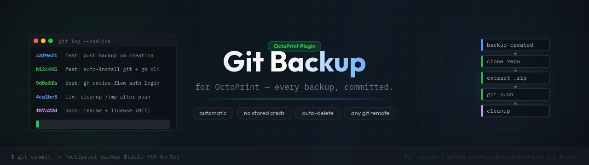

# OctoPrint Git Backup 🖨️→🐙



[](https://github.com/MauroDruwel/OctoPrint-Git-Backup/releases)
[](LICENSE)
[](https://octoprint.org)

Every backup you create gets committed and pushed to your repo. Your printer config, versioned and off-site.

Works with GitHub, GitLab, Gitea, Bitbucket, self-hosted — anything git can push to.

## Setup

**1. Install the plugin** via OctoPrint Settings → Plugin Manager → Install from URL:
```
https://github.com/MauroDruwel/OctoPrint-Git-Backup/archive/main.zip
```

**2. Get git authenticated** — on Raspberry Pi OS / Ubuntu / Debian, the plugin settings panel has one-click install buttons for `git` and the GitHub CLI, plus a guided `gh auth login` flow. On other platforms install git yourself and authenticate however you normally would (SSH key, OS credential manager, etc.).

**3. Paste your repo URL** in Settings → Git Backup Plugin and save.

That's it. Next backup gets pushed automatically.

## Auth methods

| Method | Works with |
|---|---|
| GitHub CLI (`gh auth login`) | GitHub HTTPS — easiest, auto-configures the credential helper |
| SSH key | Any git host — use a `git@host:user/repo.git` URL |
| OS credential manager | Any HTTPS remote — `git config --global credential.helper <helper>` |

## How it works

```
backup created
      │
      ▼
  clone repo → /tmp/octoprint_git_backup_*
      │
      ▼
  clear old files (keep .git + README.md)
      │
      ▼
  extract backup .zip
      │
      ▼
  git commit + push  ──→  your repo
      │
      ▼
  cleanup /tmp  (+ optionally delete local .zip)
```

Commits are authored as `octoprint-backup[bot]`.

## License

[MIT](LICENSE)
